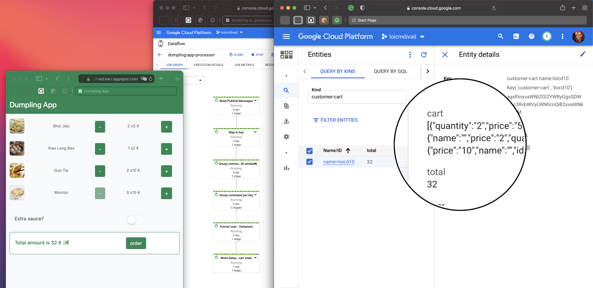

# Dumpling App Processor

###### Code example of the blog post: [dumpling-app](../)

This module represents the processing layer of a fictional OMS. It continuously handles user orders
in real-time via Pub/Sub and Dataflow. Finally, it stores the user shopping cart in cloud Firestore.
Find more in the
article: [Explore data contracts with Cloud Pub/Sub](https://blog.loicmdivad.com/posts/2020/04/explore-data-contracts-with-cloud-pub-sub)

## Story

The Dumpling Store has an application to order food on site. The dumpling-app produces records in
Cloud Pub/Sub topic everytime a user click on the interface. This module consumes order event and
computes user shopping cart in realtime by levering the Pub/Sub Message schema feature.



## Plugin

The team producing the input records owns the record schema. So we can't just copy the schema in
this module. To solve that we draft a maven plugin capable of getting the schema from GCP. Schemas
are stored in [dumpling-app-service](../dumpling-app-service/) but also exposed by the Pub/Sub
Message Schema.

```xml

<plugin>
    <groupId>fr.ldivad.dumpling</groupId>
    <artifactId>pubsub-schema-maven-plugin</artifactId>
    <version>0.1.0-SNAPSHOT</version>
    <configuration>
        <schemas>
            <schema>dumpling-commands</schema>
            <schema>dumpling-checkout</schema>
            <!-- list all schema names-->
        </schemas>
    </configuration>
    <executions>
        <execution>
            <phase>generate-sources</phase>
            <goals>
                <goal>proto-files</goal>
            </goals>
        </execution>
    </executions>
</plugin>
```

This will simply perform the command:
```bash
 gcloud pubsub schemas describe <schema-name>
```

Can be improved by calling the right APIs.

## Processing

1. Consume and deserialize command record from Pub/Sub
2. Map commands into (Key, Value) pairs
3. Group into 3h windows
4. Group by key (User/Session)
5. Produce the shopping cart state to Datastore

## Usage

1. Make sure the listed schema to download exist

2. Compile and upload the Dataflow template:
```bash
mvn compile exec:java \
   -Dexec.mainClass=fr.ldivad.dumpling.Main \
   -Dexec.args="--runner=DataflowRunner \
                --project= <???> \
                --stagingLocation= <???> \
                --templateLocation= <???>
                --region= <???>"
```

3. Define the tf variables in `terraform/dev.auto.tfvars` by following [the doc](terraform/README.md):
```hcl
gcp_project                = "<???>"
service_account_id         = "<???>"
gcs_bucket                 = "<???>"
gcp_zone                   = "<???>"
dataflow_template_location = "<???>"
dataflow_gcs_location      = "<???>"
topic_subscription         = "<???>"
```

4. Run the manifest
```bash
terraform apply
```

## Improvement
