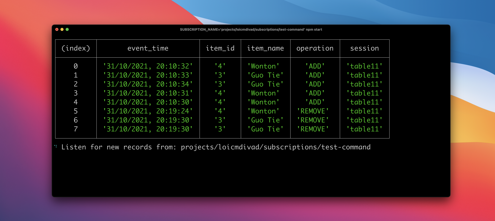

# Dumpling App Cli

###### Code example of the blog post: [dumpling-app](../)

Subscribes to a Pub/Sub topic and format the output to showcase the result of the
application [../dumpling-app-service](../dumpling-app-service)

## Usage

```bash
npm install
SUBSCRIPTION_NAME='projects/?/subscriptions/?' npm start
```

